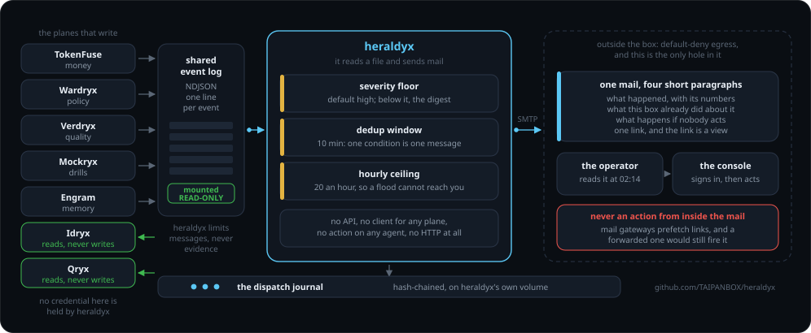
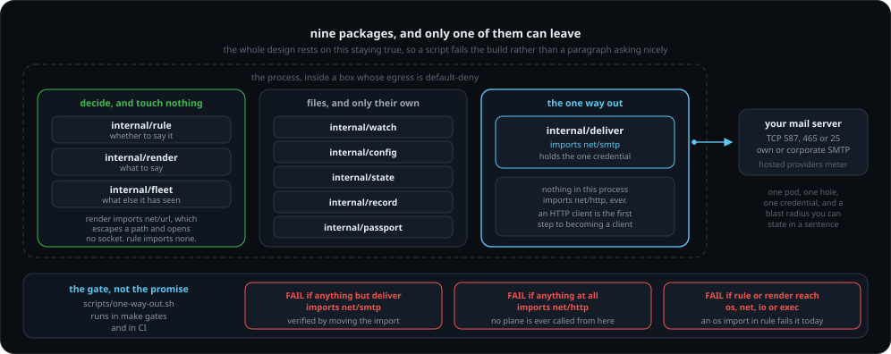
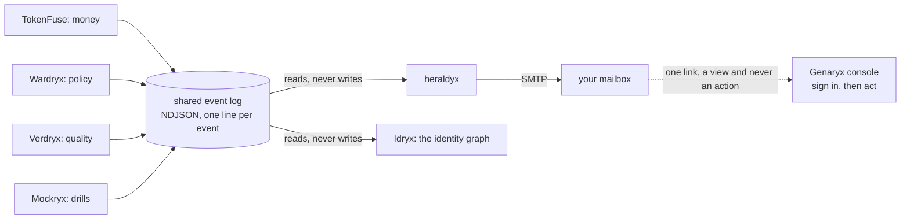
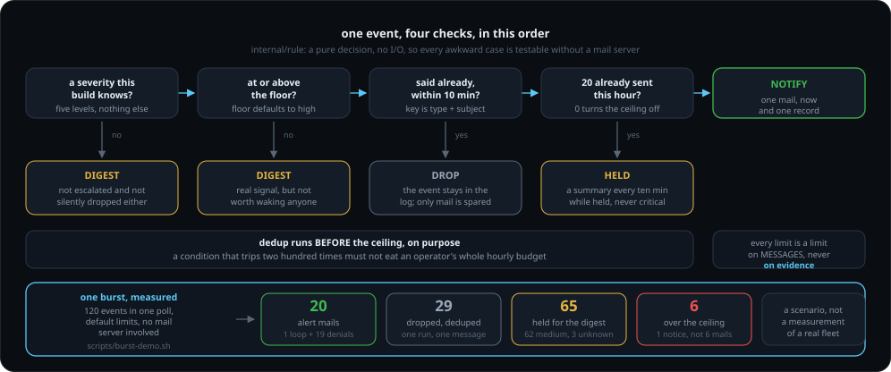
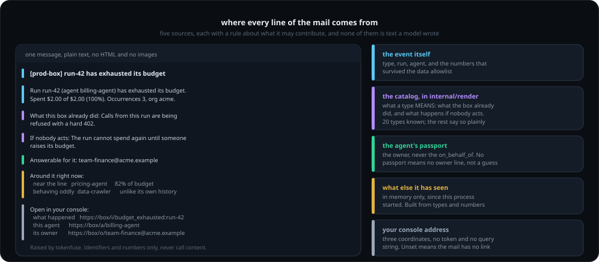
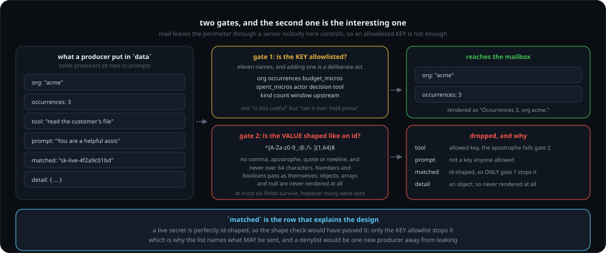
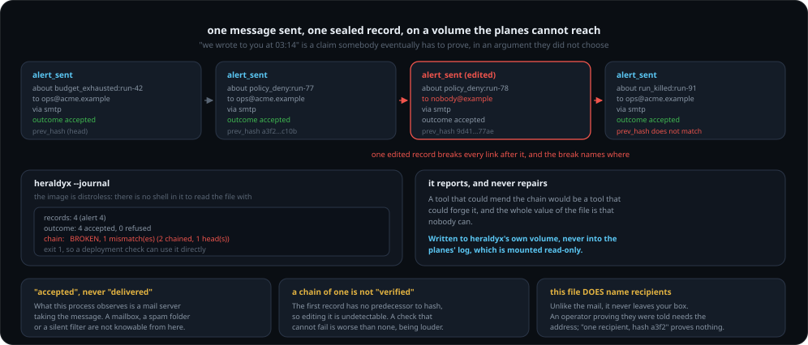

<div align="center">

# heraldyx - the box tells you

**Your agents run on your infrastructure. When one of them is heading somewhere you would want to know about, this is the part that writes to you.**

[](https://github.com/TAIPANBOX/heraldyx/actions/workflows/ci.yml)




</div>

heraldyx watches the NDJSON event log the [TAIPANBOX](https://github.com/TAIPANBOX)
agent-governance stack already writes, decides which of those events a human
should hear about tonight rather than tomorrow, and mails them. The mail comes
from the operator's own box, and it carries a link into the operator's own
console.

It reads a file and sends mail. That is the whole of it, and the narrowness is
the design: this is the one component of the box that opens a connection to
something outside it, so it is the one component whose blast radius has to be
small enough to state in a sentence.

<div align="center">



<sub>The claim is checked rather than promised: <code>scripts/one-way-out.sh</code> runs in <code>make gates</code> and in CI.</sub>

</div>

---

## Where this fits in the stack



Four planes write and two read. Idryx is the other reader: it loads the same
log to build an identity graph, and like heraldyx it never writes to it.

Every plane already speaks one envelope
([agent-passport](https://github.com/TAIPANBOX/agent-passport) SPEC.md 6), so
heraldyx needs no integration with any of them. It holds no credential for any
plane, has no API of its own, and can take no action on any agent.

## What reaches you, by default

Every event meets four checks, in a fixed order, and comes out of exactly one
of four doors.

<div align="center">



<sub>The numbers are from <code>scripts/burst-demo.sh</code>, which runs the real binary over a generated burst. It is a scenario: what a real fleet produces is unmeasured, and <code>VALIDATION.md</code> says so.</sub>

</div>

The floor is `high`, so this is roughly what an ordinary day is silent about
and what it is not.

| You get mail | Examples |
|---|---|
| immediately | `budget_exhausted`, `run_killed`, `policy_deny`, `dlp_block`, `sustained_loop`, `taint_block`, `quality_drift`, `sim_finding` |
| in the daily summary | `budget_threshold` and everything else below the floor, including levels this build has never heard of |
| never | anything you did not configure a recipient for, and anything about a whole organisation rather than one agent |

That last row is a boundary of this plane, and worth stating plainly rather
than discovering. The shared envelope requires an `agent_id` (agent-passport
SPEC.md section 6.1), so a fact about a whole organisation has no subject to
travel under, and no producer is allowed to invent one to make it fit.
`spend_spike` is the current example: the money plane raises it, the console
shows it, and it never arrives here. A mail whose subject line named an agent
that had not spiked would be worse than silence.

Org-wide facts live where they have always lived, in the console and in the
plane's own API. Changing that is a change to the envelope every product in the
stack shares, not something this process can decide.

<details>
<summary><b>The 18 event types this build has a sentence for</b> (anything else still arrives, and says so)</summary>

<br>

Each of these has three lines in the catalog: what happened, what the box
already did about it, and what happens if nobody acts. A type not listed here
is not dropped; it is described honestly as one this build has no description
for, and the link still opens the console at it.

| type | the mail's first sentence says the subject |
|---|---|
| `budget_threshold` | is approaching its budget |
| `budget_exhausted` | has exhausted its budget |
| `run_killed` | was killed |
| `sustained_loop` | is repeating the same step |
| `spend_spike` | is burning money far faster than it usually does |
| `fanout_explosion` | is driving far more runs at once than it usually does |
| `breaker_tripped` | was refused by the breaker |
| `unit_cap_exceeded` | has spent its business unit's monthly cap |
| `dlp_block` | tried to send something that matched a secret pattern |
| `taint_block` | was refused a tool its taint labels do not allow |
| `policy_deny` | was denied by policy |
| `approval_requested` | is waiting for a human decision |
| `approval_unanswered` | is still waiting for a human decision nobody has made |
| `approval_timeout` | presented an approval that had already expired |
| `identity_mismatch` | presented a credential that may not speak as the agent it claimed |
| `mcp_drift` | is talking to an MCP tool that changed under its pinned lock |
| `quality_drift` | is producing worse output than its baseline |
| `sim_finding` | failed a rehearsal |

`behavior_anomaly` and `excessive_privilege` were listed here until 2026-08-03.
They were removed because nothing raises them: both are concepts of the identity
plane, and idryx has no event writer at all. It reads this same log to build its
graph and answers through its own API. An entry describing an event that cannot
arrive is a claim nobody ever sees be wrong, which is the worst kind to keep.

Nothing can check that an entry is TRUE, which is why they are audited against
the producing plane's own code rather than its README. Four of the seventeen
that existed on 2026-08-03 were wrong, and each was wrong in a way that would
have sent an operator somewhere useless. See `CLAUDE.md`.

</details>

`budget_threshold` is the "approaching the line" signal, and it is deliberately
one band below the incident it precedes: nothing has gone wrong yet, and an
early warning that pages as loudly as an exhausted budget teaches its operator
to ignore both. Lower `HERALDYX_MIN_SEVERITY` to `medium` to have it mailed as
it happens.

## Running it without building it

```bash
docker pull ghcr.io/TAIPANBOX/heraldyx:v0.2.2
```

Published on a tag, for `linux/amd64` and `linux/arm64`. **Immutable versions
only**: there is no `:latest` and no `:main`, because "which build is running"
has to have an answer that does not change under the operator. A moving tag is
a deployment whose contents change without a rollout anybody recorded.

Building from source still works and is what `make build` does; it is no longer
what an install has to do.

## Try it without a mail server

```bash
make build
mkdir -p /tmp/heraldyx
HERALDYX_EVENTS=/tmp/heraldyx/events.ndjson \
HERALDYX_TO=you@example.com \
HERALDYX_MAIL_FILE=/tmp/heraldyx/mail.txt \
HERALDYX_CONSOLE_URL=https://box.example.com \
HERALDYX_MIN_SEVERITY=medium \
HERALDYX_STATE=/tmp/heraldyx/state.json \
./bin/heraldyx --once --from-now=false
```

Append an event to `/tmp/heraldyx/events.ndjson`, run it again, and read
`/tmp/heraldyx/mail.txt`. `HERALDYX_MAIL_FILE` writes what WOULD be sent, which
is also the honest way to see this in a demo: the whole chain runs except the
last mile.

To watch the three limits work rather than read about them:

```bash
./scripts/burst-demo.sh
```

It builds a burst of 120 events, runs the real binary over it with the default
limits, and prints what came out. The three limits are easy to describe and
hard to believe until a flood goes in one end and twenty messages come out the
other.

## Configuration

| variable | default | what it is |
|---|---|---|
| `HERALDYX_EVENTS` | `/var/lib/stack/events` | files and/or directories of NDJSON events; a directory contributes every `*.ndjson` in it, re-read each poll so a plane deployed later is picked up |
| `HERALDYX_TO` | (empty) | comma-separated recipients; **empty means send nothing** |
| `HERALDYX_MIN_SEVERITY` | `high` | `info` \| `low` \| `medium` \| `high` \| `critical` |
| `HERALDYX_BOX` | `agent stack` | the name in the subject line |
| `HERALDYX_CONSOLE_URL` | (empty) | base URL of your console, for the one link |
| `HERALDYX_STATE` | `/var/lib/stack/heraldyx/state.json` | offsets and dedup counters |
| `HERALDYX_MAIL_FILE` | (empty) | write messages here instead of sending them |
| `HERALDYX_SMTP_HOST` | (empty) | `host:port` of your mail server |
| `HERALDYX_SMTP_FROM` | (empty) | envelope sender |
| `HERALDYX_SMTP_USER` / `_PASS` | (empty) | credentials, if your server wants them |
| `HERALDYX_DEDUP_SECONDS` | `600` | quiet window per condition |
| `HERALDYX_MAX_PER_HOUR` | `20` | ceiling on immediate messages, `0` for none |
| `HERALDYX_DIGEST_HOURS` | `24` | how often the below-the-floor summary goes out, `0` for never |
| `HERALDYX_POLL_MS` | `2000` | how often to read the log |
| `HERALDYX_SENT` | beside the state file | the dispatch journal; empty disables recording |
| `HERALDYX_PASSPORTS` | (empty) | a directory of agent-passport JSON, read to name who is answerable; empty means alerts carry no owner |

### Proving the SMTP path without a mail account

```bash
python3 scripts/smtp-sink.py &          # a server that answers, on :2525
HERALDYX_SMTP_HOST=127.0.0.1:2525 HERALDYX_SMTP_FROM=box@example.com \
HERALDYX_TO=ops@example.com ... ./bin/heraldyx --once --from-now=false
```

The sink prints the whole session and the message exactly as it arrived, so the
protocol, the headers and the body are observed rather than asserted. It is not
a mail server and proves nothing about deliverability; it proves that this
client talks to something that speaks SMTP, which is the part unit tests
cannot reach. See `VALIDATION.md` for the run.

`--test-mail` sends one message and exits. Installers run it while the operator
is still at the keyboard, because a wrong SMTP setting that surfaces a week
later, through an alert that never arrived, is the worst failure this component
has.

## What an alert actually says

```
[prod-box] run-42 has exhausted its budget

Run run-42 (agent billing-agent) has exhausted its budget. Occurrences 3, org acme.

What this box already did: Calls from this run are being refused with a hard 402.
If nobody acts: The run cannot spend again until someone raises its budget.

Answerable for it: team-finance@acme.example

Around it right now:
  near the line   pricing-agent        82% of budget
  behaving oddly  data-crawler         behaving unlike its own history
  behaving oddly  runbook-executor     repeating the same step (14 times)

Open in your console:
  what happened   https://box/i/budget_exhausted:run-42
  this agent      https://box/a/billing-agent            (freeze, kill)
  its owner       https://box/o/team-finance@acme.example (everything they run)
```

<div align="center">



<sub>Five sources, each with a rule about what it may contribute, and not one of them is free text.</sub>

</div>

**"Around it right now"** is built from the same event log this process already
reads, so it costs no new input and cannot be stale in a way the alert is not.
It lives in memory only: this is what the notifier has seen since it started,
and a fresh process says less rather than describing a fleet from before a
rollout. Every phrase in it comes from an event's TYPE and its numeric fields,
never from text a producer wrote.

**"Answerable for it"** comes from the agent's passport, not from the event: the
envelope carries `agent_id` and `on_behalf_of`, and neither is the owner.
`HERALDYX_PASSPORTS` is optional and unset by default, and an agent with no
passport gets no owner line. This process does not invent one.

**The three links** are the three things an operator wants at two in the
morning, and all three are views. The action happens in the console after a
sign-in, and a destructive one after a passkey.

## What is in the mail, and what is not

Four short paragraphs: what happened with its numbers, what the box already did
about it, what happens if nobody acts, and one link.

**Identifiers and numbers only.** An event's `data` can hold anything a
producer put there, and some producers sit next to prompts, model output and
matched secrets. Mail leaves your perimeter through a server we do not control,
so `data` is rendered through an allowlist of keys whose values must also look
like identifiers or numbers. A denylist would be one new producer away from
leaking.

<div align="center">



<sub>The <code>matched</code> row is the one that carries the design: a live secret passes the shape check comfortably, so the KEY list is what stops it.</sub>

</div>

**One link, and it is a view.** The mail never carries an action. A link that
acts is an unauthenticated capability held by anyone who sees or forwards the
message, and mail security gateways prefetch links, which would fire the action
before a human read the sentence next to it. The link opens your console at
that event; you sign in there, and destructive actions ask for your passkey.

## What it wrote to you, afterwards

Every message this process sends leaves one record behind it: an agent-event in
the shared envelope, appended to a hash-chained NDJSON file
(`sent.ndjson`, beside the state file). One line per message, carrying who was
written to, what it was about, which transport carried it, and whether that
transport took it. There is one exception, named below, and the process tells
you when it happens rather than leaving you to find it.

```bash
heraldyx --journal        # from the box, no shell needed
agent-conform -chain sent.ndjson   # or with the estate's own checker
```

`--journal` exists because the image is distroless: there is no shell in it to
`cat` the file with, which is the right posture for the one process with a way
out and also means an operator would otherwise have to copy a volume out to
read their own record. It reports and never repairs, and it exits non-zero on a
broken chain so a deployment check can use it directly:

```
journal: /var/lib/stack/heraldyx/sent.ndjson
records: 2 (alert 2)
outcome: 2 accepted, 0 refused
chain:   verifies (1 chained, 1 head(s))
last:    2026-08-02T18:08:49Z  budget_exhausted:run-99 -> ops@example.com (accepted)
```

(`agent-conform` is the checker in
[agent-stack-go](https://github.com/TAIPANBOX/agent-stack-go), the same module
that writes the chain.)

<div align="center">



<sub>The broken-chain output above is a real one: a four-record journal with its third record edited.</sub>

</div>

Two words in there are chosen carefully.

**"accepted", not "delivered".** What this process observes is a mail server
taking the message. Whether it reached a mailbox, a spam folder or a filter
that drops it silently is not knowable from here.

**The exception: a record needs an agent to name.** The shared envelope requires
an `agent_id` and nothing here invents one (see the boundary further down). A
digest or a ceiling notice sent in a cycle where no single agent caused a message
has nothing to be filed under, so the mail goes out and the record does not. The
same is true of a write that simply fails, since the mail has already gone by
then. Neither is silent. The process says so on stderr:

```
record: 1 message(s) sent without a record just now, 1 since this process
started: no agent id to file them under, or the write failed. The mail went out
either way, and the journal is short by that many.
```

`--journal` cannot show you this and does not pretend to: a record that was
never written leaves no trace in the file it would have been written to, so the
count lives in the log of the process that knows it.

**The journal names the recipients**, unlike the mail itself, which carries
identifiers and numbers only. The difference is where each one goes: mail
leaves your perimeter through a server we do not control, and this file never
leaves your box. An operator proving they were told needs the address, and "one
recipient, hash a3f2" proves nothing to anybody.

It is written to heraldyx's own volume, never into the planes' event log. That
log is mounted read-only here on purpose, and it stays that way.

## What it does not do

- **It does not queue.** A message that cannot be delivered is logged, written
  into the dispatch journal as a refusal, and dropped. A retry queue inside the
  one process with a way out is the opposite of the design, and the event itself
  is still in the log, which outlives this process.
- **It does not know your working hours.** Quiet hours are designed and not
  built; the ceiling and the digest are the only volume controls.
- **It does not talk to any plane.** No polling of an API, no credential, no
  client. If a fact is not in the event log, heraldyx does not know it.
- **It does not ship the journal to the record plane.** Trailryx's ingest is
  OTLP over HTTP with a protobuf body, and this is the one process in the box
  with a way out: an HTTP client and a protobuf encoder do not belong in it.
  What is written here is already sealed and already verifiable, so shipping it
  is transport, and transport belongs to something else.
- **It does not report anything about an organisation as a whole.** See the
  boundary above: no `agent_id`, no subject, no mail. This is the one class of
  signal the stack raises that this process cannot see, and the fix is not here.
- **It does not carry history.** A first run starts at the end of the log,
  because a month of old incidents arriving at once is how an operator learns
  to filter this sender to trash. Pass `--from-now=false` to read from the
  beginning.

## Gates

```sh
make gates
```

which is `gofmt`, `go vet`, `staticcheck`, `go test -race ./...`, `gosec`,
`govulncheck` and `./scripts/one-way-out.sh`: the same set CI runs, in the same
order, so a green local run means a green CI run.

The last one holds the architectural claim this component makes: SMTP lives in
`internal/deliver` and nowhere else, nothing here speaks HTTP, and the layer
that decides what to say does no I/O at all. See `VALIDATION.md` for what has
been verified and how.

## License

Apache-2.0. This stack is defensive: it exists so an organization can govern
and audit its own agents.
