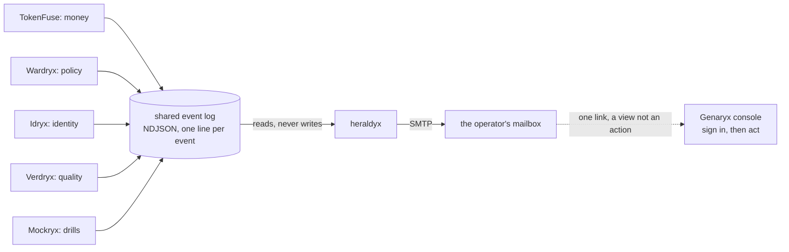

<div align="center">

# heraldyx - the box tells you

**Your agents run on your infrastructure. When one of them is heading somewhere you would want to know about, this is the part that writes to you.**

[](https://github.com/TAIPANBOX/heraldyx/actions/workflows/ci.yml)


-success.svg)

</div>

heraldyx watches the NDJSON event log the [TAIPANBOX](https://github.com/TAIPANBOX)
agent-governance stack already writes, decides which of those events a human
should hear about tonight rather than tomorrow, and mails them. The mail comes
from the operator's own box, and it carries a link into the operator's own
console.

It reads a file and sends mail. That is the whole of it, and the narrowness is
the design: this is the one component of the box that opens a connection to
something outside it, so it is the one component whose blast radius has to be
small enough to state in a sentence.

---

## Where this fits in the stack



Every plane already speaks one envelope
([agent-passport](https://github.com/TAIPANBOX/agent-passport) SPEC.md 6), so
heraldyx needs no integration with any of them. It holds no credential for any
plane, has no API of its own, and can take no action on any agent.

## What reaches you, by default

The floor is `high`, so this is roughly what an ordinary day is silent about
and what it is not.

| You get mail | Examples |
|---|---|
| immediately | `budget_exhausted`, `run_killed`, `policy_deny`, `dlp_block`, `sustained_loop`, `behavior_anomaly`, `quality_drift`, `sim_finding` |
| in the daily summary | `budget_threshold` and everything else below the floor, including levels this build has never heard of |
| never | anything you did not configure a recipient for |

`budget_threshold` is the "approaching the line" signal, and it is deliberately
one band below the incident it precedes: nothing has gone wrong yet, and an
early warning that pages as loudly as an exhausted budget teaches its operator
to ignore both. Lower `HERALDYX_MIN_SEVERITY` to `medium` to have it mailed as
it happens.

## Running it without building it

```bash
docker pull ghcr.io/TAIPANBOX/heraldyx:v0.1.0
```

Published on a tag, for `linux/amd64` and `linux/arm64`. **Immutable versions
only**: there is no `:latest` and no `:main`, because "which build is running"
has to have an answer that does not change under the operator. A moving tag is
a deployment whose contents change without a rollout anybody recorded.

Building from source still works and is what `make build` does; it is no longer
what an install has to do.

## Try it without a mail server

```bash
make build
mkdir -p /tmp/heraldyx
HERALDYX_EVENTS=/tmp/heraldyx/events.ndjson \
HERALDYX_TO=you@example.com \
HERALDYX_MAIL_FILE=/tmp/heraldyx/mail.txt \
HERALDYX_CONSOLE_URL=https://box.example.com \
HERALDYX_MIN_SEVERITY=medium \
HERALDYX_STATE=/tmp/heraldyx/state.json \
./bin/heraldyx --once --from-now=false
```

Append an event to `/tmp/heraldyx/events.ndjson`, run it again, and read
`/tmp/heraldyx/mail.txt`. `HERALDYX_MAIL_FILE` writes what WOULD be sent, which
is also the honest way to see this in a demo: the whole chain runs except the
last mile.

## Configuration

| variable | default | what it is |
|---|---|---|
| `HERALDYX_EVENTS` | `/var/lib/stack/events` | files and/or directories of NDJSON events; a directory contributes every `*.ndjson` in it, re-read each poll so a plane deployed later is picked up |
| `HERALDYX_TO` | (empty) | comma-separated recipients; **empty means send nothing** |
| `HERALDYX_MIN_SEVERITY` | `high` | `info` \| `low` \| `medium` \| `high` \| `critical` |
| `HERALDYX_BOX` | `agent stack` | the name in the subject line |
| `HERALDYX_CONSOLE_URL` | (empty) | base URL of your console, for the one link |
| `HERALDYX_STATE` | `/var/lib/stack/heraldyx/state.json` | offsets and dedup counters |
| `HERALDYX_MAIL_FILE` | (empty) | write messages here instead of sending them |
| `HERALDYX_SMTP_HOST` | (empty) | `host:port` of your mail server |
| `HERALDYX_SMTP_FROM` | (empty) | envelope sender |
| `HERALDYX_SMTP_USER` / `_PASS` | (empty) | credentials, if your server wants them |
| `HERALDYX_DEDUP_SECONDS` | `600` | quiet window per condition |
| `HERALDYX_MAX_PER_HOUR` | `20` | ceiling on immediate messages, `0` for none |
| `HERALDYX_DIGEST_HOURS` | `24` | how often the below-the-floor summary goes out, `0` for never |
| `HERALDYX_POLL_MS` | `2000` | how often to read the log |
| `HERALDYX_SENT` | beside the state file | the dispatch journal; empty disables recording |

### Proving the SMTP path without a mail account

```bash
python3 scripts/smtp-sink.py &          # a server that answers, on :2525
HERALDYX_SMTP_HOST=127.0.0.1:2525 HERALDYX_SMTP_FROM=box@example.com \
HERALDYX_TO=ops@example.com ... ./bin/heraldyx --once --from-now=false
```

The sink prints the whole session and the message exactly as it arrived, so the
protocol, the headers and the body are observed rather than asserted. It is not
a mail server and proves nothing about deliverability; it proves that this
client talks to something that speaks SMTP, which is the part unit tests
cannot reach. See `VALIDATION.md` for the run.

`--test-mail` sends one message and exits. Installers run it while the operator
is still at the keyboard, because a wrong SMTP setting that surfaces a week
later, through an alert that never arrived, is the worst failure this component
has.

## What is in the mail, and what is not

Four short paragraphs: what happened with its numbers, what the box already did
about it, what happens if nobody acts, and one link.

**Identifiers and numbers only.** An event's `data` can hold anything a
producer put there, and some producers sit next to prompts, model output and
matched secrets. Mail leaves your perimeter through a server we do not control,
so `data` is rendered through an allowlist of keys whose values must also look
like identifiers or numbers. A denylist would be one new producer away from
leaking.

**One link, and it is a view.** The mail never carries an action. A link that
acts is an unauthenticated capability held by anyone who sees or forwards the
message, and mail security gateways prefetch links, which would fire the action
before a human read the sentence next to it. The link opens your console at
that event; you sign in there, and destructive actions ask for your passkey.

## What it wrote to you, afterwards

Every message this process sends leaves one record behind it: an agent-event in
the shared envelope, appended to a hash-chained NDJSON file
(`sent.ndjson`, beside the state file). One line per message, carrying who was
written to, what it was about, which transport carried it, and whether that
transport took it.

```bash
heraldyx --journal        # from the box, no shell needed
agent-conform -chain sent.ndjson   # or with the estate's own checker
```

`--journal` exists because the image is distroless: there is no shell in it to
`cat` the file with, which is the right posture for the one process with a way
out and also means an operator would otherwise have to copy a volume out to
read their own record. It reports and never repairs, and it exits non-zero on a
broken chain so a deployment check can use it directly:

```
journal: /var/lib/stack/heraldyx/sent.ndjson
records: 2 (alert 2)
outcome: 2 accepted, 0 refused
chain:   verifies (1 chained, 1 head(s))
last:    2026-08-02T18:08:49Z  budget_exhausted:run-99 -> ops@example.com (accepted)
```

(`agent-conform` is the checker in
[agent-stack-go](https://github.com/TAIPANBOX/agent-stack-go), the same module
that writes the chain.)

Two words in there are chosen carefully.

**"accepted", not "delivered".** What this process observes is a mail server
taking the message. Whether it reached a mailbox, a spam folder or a filter
that drops it silently is not knowable from here.

**The journal names the recipients**, unlike the mail itself, which carries
identifiers and numbers only. The difference is where each one goes: mail
leaves your perimeter through a server we do not control, and this file never
leaves your box. An operator proving they were told needs the address, and "one
recipient, hash a3f2" proves nothing to anybody.

It is written to heraldyx's own volume, never into the planes' event log. That
log is mounted read-only here on purpose, and it stays that way.

## What it does not do

- **It does not queue.** A message that cannot be delivered is logged and
  dropped. The event itself is still in the log, which outlives this process.
- **It does not know your working hours.** Quiet hours are not implemented in
  v0.1; the ceiling and the digest are the only volume controls.
- **It does not talk to any plane.** No polling of an API, no credential, no
  client. If a fact is not in the event log, heraldyx does not know it.
- **It does not ship the journal to the record plane.** Trailryx's ingest is
  OTLP over HTTP with a protobuf body, and this is the one process in the box
  with a way out: an HTTP client and a protobuf encoder do not belong in it.
  What is written here is already sealed and already verifiable, so shipping it
  is transport, and transport belongs to something else.
- **It does not carry history.** A first run starts at the end of the log,
  because a month of old incidents arriving at once is how an operator learns
  to filter this sender to trash. Pass `--from-now=false` to read from the
  beginning.

## Gates

```sh
make gates
```

which is `gofmt`, `go vet`, `staticcheck`, `go test -race ./...`, `gosec`,
`govulncheck` and `./scripts/one-way-out.sh`: the same set CI runs, in the same
order, so a green local run means a green CI run.

The last one holds the architectural claim this component makes: SMTP lives in
`internal/deliver` and nowhere else, nothing here speaks HTTP, and the layer
that decides what to say does no I/O at all. See `VALIDATION.md` for what has
been verified and how.

## License

Apache-2.0. This stack is defensive: it exists so an organization can govern
and audit its own agents.
